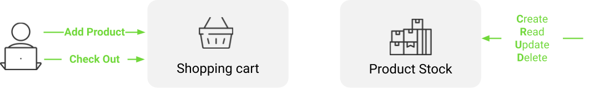
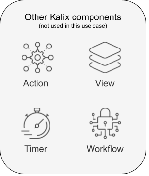
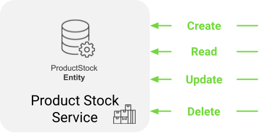
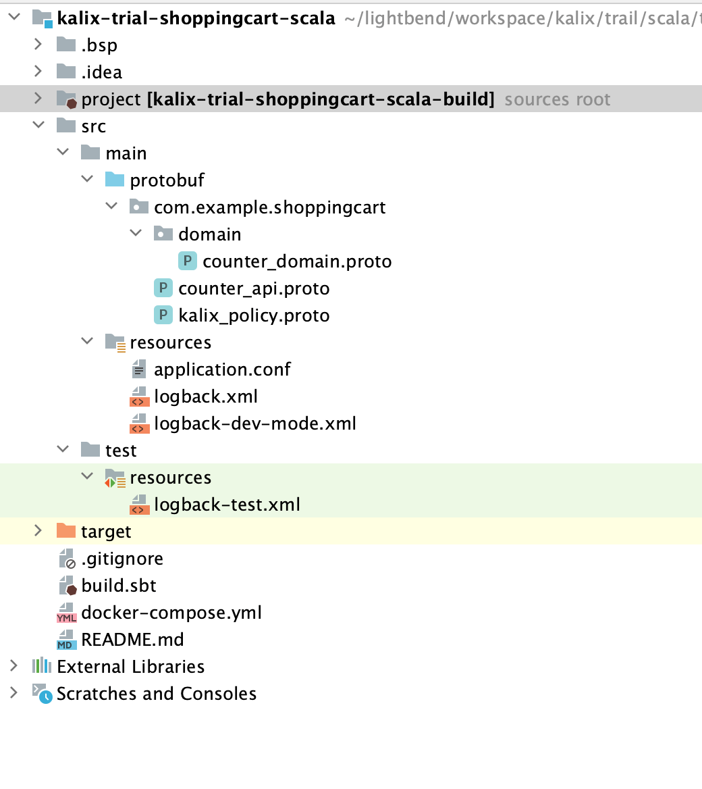

# Prerequisite
Java 11 or later<br>
SBT 1.3.6 or later<br>
Docker 20.10.14 or higher (to run locally)<br>
# Introduction

If you have gone through the `Explore Kalix Virtaully` journey, you are all set to :
- [Run locally in prod-like environment](#run-locally-in-prod-like-environment) <br>
- [Deploy and run on Kalix Platform on Cloud Provider of your choice ](deploy-and-run-on-kalix-platform-on-cloud-provider-of-your-choice)

However, if you would like to better understand the `Kalix Developer Experience` and how to build applications on Kalix, here is more detail on the same usecase.
# Kalix Trial - eCommerce - Scala
## Designing Kalix Services
### Use case
<br>
eCommerce use case is a simple shopping cart example consisting of product stock and shopping cart.
Product stock models stock (simple quantity) of products that are being sold and Shopping Cart models list of products customer intends to buy.<br>
In this exercise the focus is on implementing Product Stock functionalities
#### Product Stock
Data model:
- quantity

**Note**: Product stock data model does not hold the productId because the HTTP/REST API is designed around productId itself.
Operations:
- CREATE/READ/UPDATE/DELETE product stock

### Kalix components
Kalix components serve to abstract functionalities.<br>
In this particular use case, we will utilize a Kalix component known as `Entity`.<br>
<br>
Entity:
- component for modeling of data and data business logic operations
- removes complexities around data:
    - caching
    - concurrency
    - distributed locking
- simplifies data modeling, business logic implementation with out-of-the box scalability, resilience
  Kalix provides other components that are not used in this use case and more details can be found in [Kalix documentation](https://docs.kalix.io/):<br>
  <br>

### Design Product Stock Kalix service
**Product Stock Service**
- implements Product Stock functionalities
- Kalix component used: Entity



**ProductStock Entity**
- models one product stock instance and business logic operations over that one instance

**Data model**
- quantity

**API**
- HTTP/RES
- Endpoints:
    - **Create**
      `POST /product-stock/{productId}/create`

      Request (JSON):
        - quantity (int)

      Response (JSON): {}
    - **Read**
      `GET /product-stock/{productId}/get`
      Request (JSON): No body

      Response (JSON):
        - quantity (int)
    - **Update**
      `PUT /product-stock/{productId}/update`

      Request (JSON):
        - quantity (int)

      Response (JSON): {}
    - **Delete**
      `DELETE /product-stock/{productId}/delete`

      Request (JSON): No body

      Response (JSON): {}

## Kickstart Kalix development project
### Kalix giter8 template
Kalix [giter8](https://www.foundweekends.org/giter8/) generates a new Scala development project from Kalix template
### Create shopping cart Scala project from Kalix template
Execute in command line:
```
sbt new lightbend/kalix-value-entity.g8
```
Use this setup:
```
name [My Kalix Project]: kalix-trial-shoppingcart-scala
sbt_version [1.9.2]: <enter>
scala_version [2.13.10]: <enter>
package [com.example]: com.example.shoppingcart
```
giter8 generates Scala project:



- `build.sbt` with all pre-configured SBT plugins and dependencies required development, testing and packaging of Kalix service code
- `src/main/protobuf` directory with Kalix protobuf examples
- `src/main/resources` directory with minimal required configuration
- `src/test/resources` directory with minimal required configuration for test

**Note**: delete Kalix protobuf example files (`counter_api.proto`, `domain/counter_domain.proto`). Also delete `domain` directory. <br>
**Note**: `kalix_policy.proto` is used to configure Kalix ACLs on service level. More information can be found in [documenation](https://docs.kalix.io/java-protobuf/access-control.html). 

## Define data structure
1. Create package `productstock` in `src/main/protobuf`
2. Create protobuf file `productstock_domain.proto` in `src/main/protobuf/productstock`
3. Add `ProductStock` protobuf definition that represents `ProductStock` data structure that is persisted:
```
syntax = "proto3";
package com.example.shoppingcart.productstock;
message ProductStock{
    int32 quantity = 1;
}
```

## Define API - Product Stock Entity API
1. Create protobuf file `productstock_api.proto` in `src/main/protobuf/productstock`
2. Add protobuf definitions represending Product Stock API requests:
```
syntax = "proto3";

import "google/protobuf/empty.proto";
import "kalix/annotations.proto";
import "google/api/annotations.proto";

import "com/example/shoppingcart/productstock/productstock_domain.proto";

package com.example.shoppingcart.productstock;

message CreateProductStockRequest {
  string product_id = 1 [(kalix.field).entity_key = true];
  int32 quantity = 2;
}

message UpdateProductStockRequest {
  string product_id = 1 [(kalix.field).entity_key = true];
  int32 quantity = 2;
}

message DeleteProductStockRequest {
  string product_id = 1 [(kalix.field).entity_key = true];
}

message GetProductStock {
  string product_id = 1 [(kalix.field).entity_key = true];
}
```
3. Add protobuf definition for a `Product Stock` GRPC service with corresponding `rpc` methods representing each endpoint
```
service ProductStockService {
  rpc Create(CreateProductStockRequest) returns (google.protobuf.Empty);
  rpc Get(GetProductStock) returns (ProductStock);
  rpc Update(UpdateProductStockRequest) returns (google.protobuf.Empty);
  rpc Delete(DeleteProductStockRequest) returns (google.protobuf.Empty);
  }
```
4. Exposing HTTP/REST endpoints from GRPC service using [GRPC Transcoding HTTP/JSON to GRPC](https://cloud.google.com/endpoints/docs/grpc/transcoding) 
```
service ProductStockService {
  rpc Create(CreateProductStockRequest) returns (google.protobuf.Empty){
    option (google.api.http) = {
      post: "/product-stock/{product_id}/create"
      body: "*"
    };
  }
  rpc Get(GetProductStock) returns (ProductStock){
    option (google.api.http) = {
      get: "/product-stock/{product_id}/get"
    };
  }
  rpc Update(UpdateProductStockRequest) returns (google.protobuf.Empty){
    option (google.api.http) = {
      put: "/product-stock/{product_id}/update"
      body: "*"
    };
  }
  rpc Delete(DeleteProductStockRequest) returns (google.protobuf.Empty){
    option (google.api.http) = {
      delete: "/product-stock/{product_id}/delete"
    };
  }
}
```
## Implementing business logic
### Code generation
1. Code generation from protobuf definitions
Kalix SDK SBT plugin uses defined protobuf definitions to build required codebase (skeleton classes) where business logic can be developed in.<br>
Kalix SDK SBT plugin needs to be configured using custom kalix protobuf definition:
```
service ProductStockService {
  option (kalix.codegen) = {
    value_entity: {
      name: "com.example.shoppingcart.productstock.ProductStockEntity"
      entity_type: "product-stock"
      state: "com.example.shoppingcart.productstock.ProductStock"
    }
  };
```
- `value_entity` configures key-value as a durable storage model
- `name` configures the name of the `Entity` class that is being generated 
- `entity_type` configures the entity type reference name that can be used to reference `Entity` in other Kalix components
- `state` configures the reference to `ProductStock` protobuf definition defined in `productstock_domain.proto`

2. Generate code using Kalix SBT plugin:
```
sbt compile
```
Generated code in `src`:
- `src/main/scala`
  - `Main` object for bootstraping Kalix service where all used Kalix components need to be registered 
  - `ProductStockEntity` skeleton class where business logic needs to be developed in
- `src/test/scala`
  - `ProductStockEntitySpec` scalatest spec class for unit testing (covered in Test - Unit test section)
  - `ProductStockServiceIntegrationSpec` scalatest spec class for integration testing (covered in Test - Integration test section)

**Note:** Generated code in `src` will not be overwritten/regenerated in next in compile but only codebase in `target`.<br>
### ProductStockEntity business logic
For each `Entity` emptyState method, that returns an empty `ProductStock` needs to be implemented. We can use protobuf generated `defaultInstance`.
```
override def emptyState: ProductStock = ProductStock.defaultInstance
```
#### `create` endpoint
Business logic for create is to persist product stock data if not yet exists. In other cases returns an ERROR.
```
override def create(currentState: ProductStock, createProductStockRequest: CreateProductStockRequest): ValueEntity.Effect[Empty] = 
if (currentState == ProductStock.defaultInstance)
  effects.updateState(ProductStock.of(createProductStockRequest.quantity)).thenReply(Empty.defaultInstance)
else
  effects.error("Already created")
```
### `get` endpoint
Business logic for get is to get product stock data if it exists and if not return not found error.
```
override def get(currentState: ProductStock, getProductStock: GetProductStock): ValueEntity.Effect[ProductStock] =
if (currentState == ProductStock.defaultInstance)
  effects.error("Not found", Status.Code.NOT_FOUND)
else
  effects.reply(currentState)

```
### `update` endpoint
Business logic for update is to update product stock data if product was already created. If product is not found, return NOT FOUND error.
```
override def update(currentState: ProductStock, updateProductStockRequest: UpdateProductStockRequest): ValueEntity.Effect[Empty] =
if (currentState == ProductStock.defaultInstance)
  effects.error("Not found", Status.Code.NOT_FOUND)
else
  effects.updateState(currentState.withQuantity(updateProductStockRequest.quantity)).thenReply(Empty.defaultInstance)
```
### `delete` endpoint
Business logic for delete is delete data if product stock exists and return NOT FOUND error if not.
Here the soft delete is done by updating the state to `ProductStock.defaultInstance`.
```
override def delete(currentState: ProductStock, deleteProductStockRequest: DeleteProductStockRequest): ValueEntity.Effect[Empty] =
if (currentState == ProductStock.defaultInstance)
  effects.error("Not found", Status.Code.NOT_FOUND)
else
  effects.updateState(ProductStock.defaultInstance).thenReply(Empty.defaultInstance)
```
## Test
Kalix comes with very rich test kit for unit and integration testing of Kalix code.

`Test kit` provides help (custom assertions, mocks,...) with:
- unit testing of individual Kalix components (e.g `Entity`) in isolation
- integration testing in Kalix Platform simulated environment in isolation

- Allows easy test automation with very high test coverage

### Unit test
1. Edit `test/scala/com/example/shoppingcart/productstock/ProductStockEntitySpec`
2. Delete all tests instead of `handle command Create`
3. `ProductStockEntityTestKit` is a generated testKit class used for unit testing `Value Entity` component. It is for unit testing one product stock instance so `productId` needs to be provided. 
    Call methods are generated based on the entity endpoints.
```
"handle command Create" in {
  val productId = UUID.randomUUID.toString
  val quantity = 10
  val testKit = ProductStockEntityTestKit(productId, new ProductStockEntity(_))
  val result = testKit.create(CreateProductStockRequest(productId = productId, quantity = quantity))
  result.isError shouldBe false
  result.reply shouldBe Empty.defaultInstance
  testKit.currentState().quantity shouldBe quantity
}
```
Run the unit test:
```
sbt test
```
### Integration test
Kalix test kit for integration testing runs code using test containers to simulate Kalix Platform runtime environment.
Integration test uses generated grpc client.
```
    "have example test that can be removed" in {
      val productId = UUID.randomUUID.toString
      val quantity = 10
      val createResult = client.create(CreateProductStockRequest(productId = productId,quantity = quantity))
      createResult.futureValue
      val getResult = client.get(GetProductStock(productId = productId))
      getResult.futureValue.quantity shouldBe quantity
    }
```
Run the integration test:
```
sbt test
```
### Run locally in prod-like environment
1. Run the Kalix Proxy container:
```
docker-compose up
```
2. Run Kalix service locally:
```
sbt run
```
This command runs the Kalix service locally and exposes it on `localhost:9000`.
#### Test
Testing using `CURL`:
1. Create product:
```
curl -XPOST -d '{ 
  "quantity": 10
}' http://localhost:9000/product-stock/apple/create -H "Content-Type: application/json"
```
Result:
```
"{}"
```
2. Get product:
```
curl -XGET http://localhost:9000/product-stock/apple/get
```
Result:
```
{"quantity":10}
```
3. Update product:
```
curl -XPUT -d '{
"quantity": 20
}' http://localhost:9000/product-stock/apple/update -H "Content-Type: application/json"
```
Result:
```
"{}"
```
4. Delete product:
```
curl -XDELETE http://localhost:9000/product-stock/apple/delete
```
Result:
```
"{}"
```
### Deploy and run on Kalix Platform on Cloud Provider of your choice
1. Install Kalix CLI
   https://docs.kalix.io/setting-up/index.html#_1_install_the_kalix_cli
2. Kalix CLI
    1. Register (FREE)
    ```
    kalix auth signup
    ```
   **Note**: Following command will open a browser where registration information can be filled in<br>
    2. Login
    ```
    kalix auth login
    ```
   **Note**: Following command will open a browser where authentication approval needs to be provided<br>

    3. Create a project
    ```
    kalix projects new kalix-trial-scala-ecommerce --region=gcp-us-east1 --organization=my-organization
    ```
   **Note**: `gcp-is-east1` is currently the only available region for deploying trial projects. For non-trial projects you can select Cloud Provider and regions of your choice<br>

    4. Authenticate local docker for pushing docker image to `Kalix Container Registry (KCR)`
    ```
    kalix auth container-registry configure
    ```
   **Note**: The command will output `Kalix Container Registry (KCR)` path that will be used with `docker push` to `KCR`<br>
    5. Extract Kalix user `username`
   ```
   kalix auth current-login
   ```
   **Note**: The command will output Kalix user details and column `USERNAME` will be used with `docker push` to `KCR`<br>
4. Build and push the project image
Trigger project build and docker push to `KCR`:
```
sbt Docker/publish -Ddocker.registry=kcr.us-east-1.kalix.io -Ddocker.username=<myusername>/kalix-trial-scala-ecommerce -Dkalix.project=kalix-trial-scala-ecommerce
```
**Note**: Replace `<myusername>` with username extracted Kalix user username done in previous section.<br>
**Note**: More details about `KCR` image name format can be found in offical documentation [here](https://docs.kalix.io/projects/container-registries.html#_pushing_an_image_to_kcr).<br>
**Note**: `kalix-trial-scala-ecommerce` is a project name
5. Deploy service in Kalix project:
 ```
kalix service deploy kcr.us-east-1.kalix.io/<username>/kalix-trial-scala-ecommerce/kalix-trial-shoppingcart-scala:latest 
 ```
**Note**: Replace `<myusername>` with username extracted Kalix user username done in previous section.
6. Check deployment:
```
kalix service list
```
Result:
```
kalix service list                                                                         
NAME                                         AGE    REPLICAS   STATUS        IMAGE TAG                     
kalix-trial-shoppingcart                     50s    0          Ready         1.0-SNAPSHOT                  
```
**Note**: When deploying service for the first time it can take up to 1 minute for internal provisioning
#### Proxy connection to Kalix service via Kalix CLI
1. Proxy connection to Kalix service via Kalix CLI
```
kalix service proxy kalix-trial-shoppingcart
```
Proxy Kalix CLI command will expose service proxy connection on `localhost:8080`.
#### Test
Testing using `CURL`:
1. Create product:
```
curl -XPOST -d '{ 
  "quantity": 10
}' http://localhost:8080/product-stock/apple/create -H "Content-Type: application/json"
```
Result:
```
"{}"
```
2. Get product:
```
curl -XGET http://localhost:8080/product-stock/apple/get
```
Result:
```
{"quantity":10}
```
3. Update product:
```
curl -XPUT -d '{
"quantity": 20
}' http://localhost:8080/product-stock/apple/update -H "Content-Type: application/json"
```
Result:
```
"{}"
```
4. Delete product:
```
curl -XDELETE http://localhost:8080/product-stock/apple/delete
```
Result:
```
"{}"
```